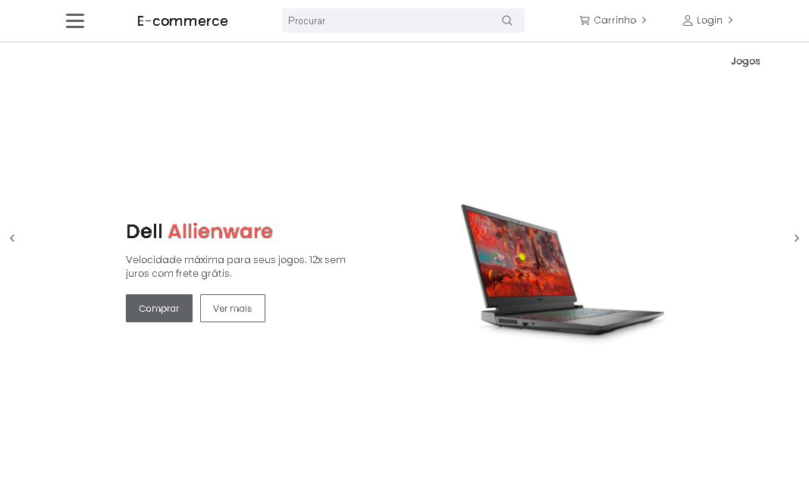
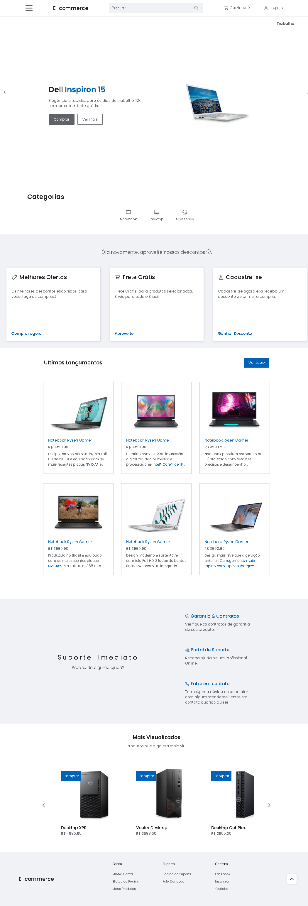

## Frontend E-commerce

E-commerce project. Frontend created to improve logic and responsiveness.

## Technology

Here are the technologies used in this project.

- HTML5
- CSS3
- JQuery

## Services Used

- Github
- Netlify

## Getting started

- Dependency

- none, just download and use

## How to use

### 1 - Homepage

### 2 - Full page

## Features

The main features of the application are:

- automatic sliders
- responsive product carousel

## Links

- Deploy on Netlify: https://js-vanilla-ecommerce.netlify.app/
- Repository: https://github.com/brunorguerra/e-commerce

## Versioning

1.0.0.0

## Authors

- **Bruno Bernardes Guerra**

Please follow github and join us!
Thanks to visiting me and good coding!
